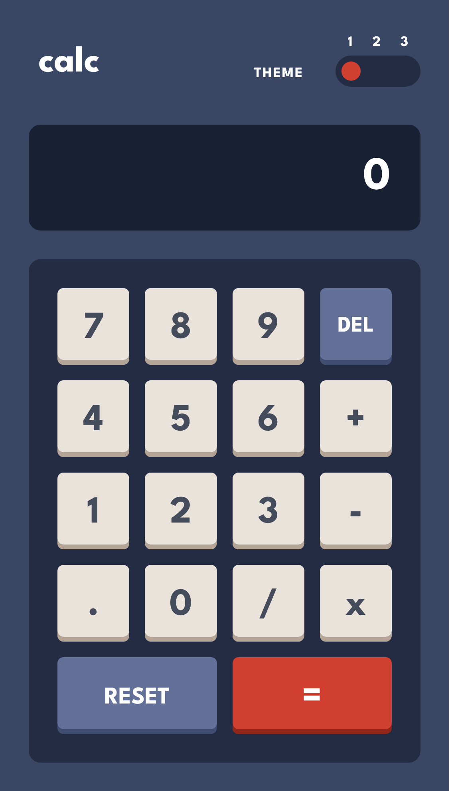
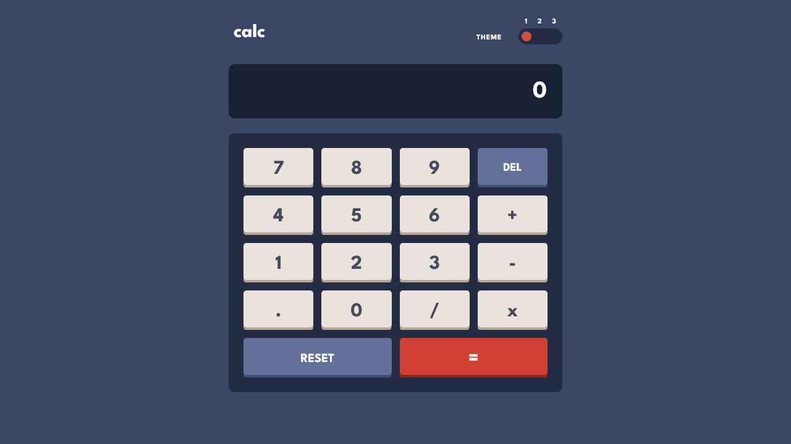

# Frontend Mentor - Calculator app solution

This is a solution to the [Calculator app challenge on Frontend Mentor](https://www.frontendmentor.io/challenges/calculator-app-9lteq5N29).

## Table of contents

- [Overview](#overview)
  - [The challenge](#the-challenge)
  - [Screenshots](#screenshots)
  - [Links](#links)
- [My process](#my-process)
  - [Built with](#built-with)
- [Author](#author)

## Overview

### The challenge

Users should be able to:

- [x] See the size of the elements adjust based on their device's screen size
  - Everything adjusts. It is currently a binary choice between screen sizes above and below 1281 pixels wide. Could improve upon this to adjust further but two is good enough for now.
- [x] Perform mathmatical operations like addition, subtraction, multiplication, and division
  - This was more of a headache than I thought it would be but I guess that's what I get for doing this with just JavaScript. I'm taking this as a sign to move towards TypeScript in the future.
- [x] Adjust the color theme based on their preference
  - This was a newer undertaking for me. I was already very familiar with CSS variables but using that in tandem with data attributes makes theme switching a lot simpler.
- [ ] **Bonus**: Have their initial theme preference checked using `prefers-color-scheme` and have any additional changes saved in the browser
  - Didn't get this sorted out just yet. Maybe someday soon...

### Screenshots

### Links

- Solution URL: [https://www.frontendmentor.io/solutions/calculator-app-cZfHkhtaew](https://www.frontendmentor.io/solutions/calculator-app-cZfHkhtaew/)
- Live Site URL: [https://creightoneli.github.io/calc](https://creightoneli.github.io/calc/)

## My process

### Built with

- Semantic HTML5 markup
- CSS custom properties/attributes
- SASS
- Flexbox
- Mobile-first workflow

## Author

- Website - [creightoneli.github.io](https://creightoneli.github.io/)
- Frontend Mentor - [@CreightonEli](https://www.frontendmentor.io/profile/CreightonEli)
- Twitter - [@creightone_dev](https://x.com/creightone_dev)
- Instagram - [creightone.dev](https://www.instagram.com/creightone.dev/)